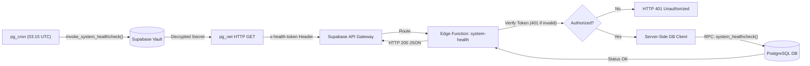

# Supabase Availability & External Heartbeat Architecture (INFRA-01B)

---

## 1. Context & Architecture

SevenPOS is built with a **local-first** foundation. Transaction processing, catalog management, sales history, and financial metrics operate locally on SQLite inside desktop and mobile terminals.

Cloud infrastructure on Supabase (PostgreSQL, Auth, Storage, Edge Functions) provides:
- Cloud identity authentication & device enrollment (`profiles`, `businesses`, `business_memberships`, `devices`)
- Multi-terminal synchronization & cloud backups

Under the **Supabase Free Tier**, projects with no active user requests for approximately 7 days may enter an auto-paused state.

---

## 2. Distinction: Internal DB Check vs. External Activity

> [!NOTE]
> **Internal DB Execution vs. External Gateway Telemetry**
> 
> - **Internal DB Health Check:** Queries executed purely inside PostgreSQL via background workers (`pg_cron`) without external ingress. Internal background execution is **not documented** as counting toward the external activity metrics used by Supabase's proxy to detect inactivity.
> - **External Gateway Activity:** Inbound HTTP requests that traverse the Supabase API Gateway and execute within the Edge Functions Deno runtime.
> 
> The **External Heartbeat (INFRA-01B)** issues a daily authenticated HTTP call via `pg_net` to the `system-health` Edge Function, generating genuine external gateway activity without requiring client-side JavaScript or browser keepalives.

---

## 3. Security & Hardening Architecture



### 3.1 Security Guardrails
1. **Endpoint Protection:** `system-health` rejects unauthenticated requests with `401 Unauthorized`.
2. **Secret Storage:** Secret token stored server-side in Edge Function configuration and in Supabase Vault (`vault.decrypted_secrets`). **Zero secrets stored in Git or frontend.**
3. **RPC Restriction:** `public.system_healthcheck()` permissions revoked from `PUBLIC`, `anon`, and `authenticated`. Callable solely via `service_role` server-side context.
4. **Zero Tenant Pollution:** No mock accounts, fake sales, dummy devices, or data mutations.
5. **Least Privilege:** Response contains only `{ "status": "ok", "checkedAt": "...", "service": "sevenpos-cloud" }`. Zero business metadata, zero user emails, zero tokens.

---

## 4. Production Commercial Recommendation

> [!IMPORTANT]
> **Pre-Production Safeguard vs. Commercial Production**
> 
> - The external heartbeat is a **temporary pre-production safeguard** during development and testing phases.
> - Supabase does not document this mechanism as a contractual guarantee against project pausing.
> - **Antes del lanzamiento comercial, SevenPOS debe migrar a un plan pago adecuado. Los proyectos de pago no están sujetos al auto-pause por inactividad.**

---

## 5. Operations & Rollback Procedures

### 5.1 Verification & Audit Queries
```sql
-- 1. Check scheduled cron jobs
SELECT * FROM cron.job WHERE jobname = 'sevenpos-daily-external-healthcheck';

-- 2. Inspect pg_cron execution history
SELECT * FROM cron.job_run_details 
WHERE jobid = (SELECT jobid FROM cron.job WHERE jobname = 'sevenpos-daily-external-healthcheck')
ORDER BY start_time DESC 
LIMIT 10;

-- 3. Inspect pg_net HTTP responses
SELECT * FROM net._http_response ORDER BY id DESC LIMIT 10;
```

### 5.2 Rollback / Deactivation Procedure
To completely remove the healthcheck infrastructure:
```sql
-- 1. Unschedule the cron job
SELECT cron.unschedule('sevenpos-daily-external-healthcheck');

-- 2. Drop the runner function
DROP FUNCTION IF EXISTS public.invoke_system_healthcheck();

-- 3. Drop the health function
DROP FUNCTION IF EXISTS public.system_healthcheck();
```
And delete the `system-health` Edge Function deployment if no longer needed.
